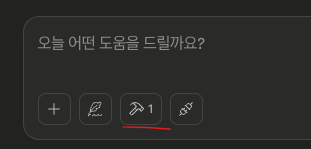
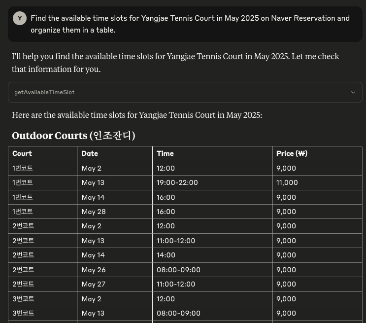
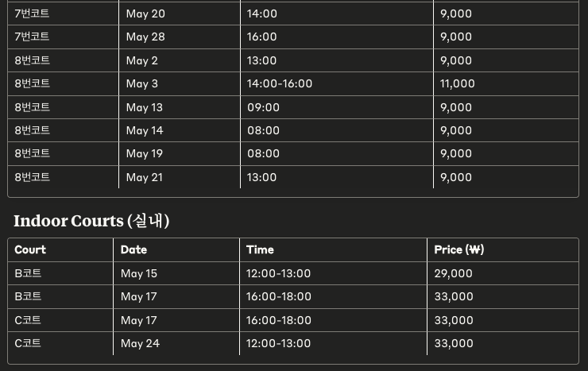

# Claude에게 테니스 예약 잔여시간 확인 시키기
양재/매헌 테니스장의 빈자리 찾기를 Claude에게 명령해서 한번에 찾기

## 🚀 How to Build & Run
```bash
go build .
```
빌드하면 **naver_reserve**라는 binary가 하나 생기는데 이를 claude와 연결해주면 된다.

## How to use it
Claude를 켜고 메뉴 > 설정 > 개발자 > 설정 편집에 가면 **claude_desktop_config.json** 파일을 열 수 있음
파일을 열고 아래를 추가
```json
{
    "mcpServers": {
        "naverbooking": {
            "command": "/path/to/naver_reserve"
        }
    }
}
```
Claude 재시작
아래처럼 망치 모양이 생겼다면 제대로 연결 됐다.



프롬프트에 아래와 같이 입력하면 결과를 받을 수 있다.
```Text
Find the available time slots for Yangjae Tennis Court in May 2025 on Naver Reservation and organize them in a table.
```



